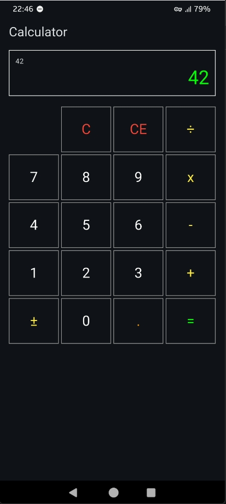
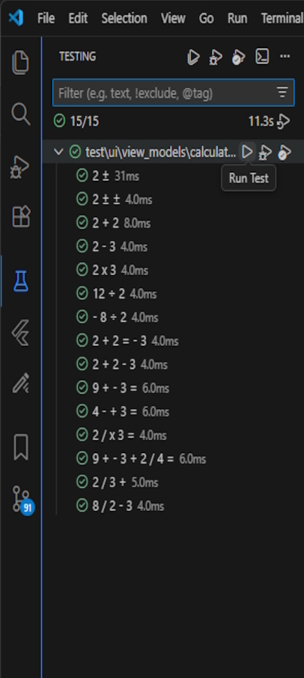

# Flutter-Calculator

A simple, yet robust Flutter project demonstrating a fully functional Calculator application capable of the four basic arithmetic operations. This app is designed to showcase modern development practices and sound architecture within the Flutter ecosystem.
All the calculatr logic is implemented in the app, without using third part math packages/libraries.

### Key Features & Technical Highlights
This project adheres to current best practices, focusing on maintainability, scalability, and testability:

- State Management: Utilizes ChangeNotifier as the core mechanism for state change notification, following the current official Flutter recommendations.
- Architecture: Implements the MVVM pattern (Model-View-ViewModel, the current official Flutter recommendation), ensuring a clear separation of business logic (Model/ViewModel) from the presentation layer (View).
- Dependency Injection (DI): Uses GetIt for service location and robust dependency injection, effectively decoupling core application services and ViewModels from the UI layer.
- Quality Assurance & Testing: This project includes comprehensive testing, implementating unit tests primarily targeting the ViewModel and the core business Logic. This ensures that the calculation logic and state management flows are verifiably correct and bug-free independent of the UI.

 

&emsp;&emsp;&emsp;

&emsp;&emsp;&emsp;

